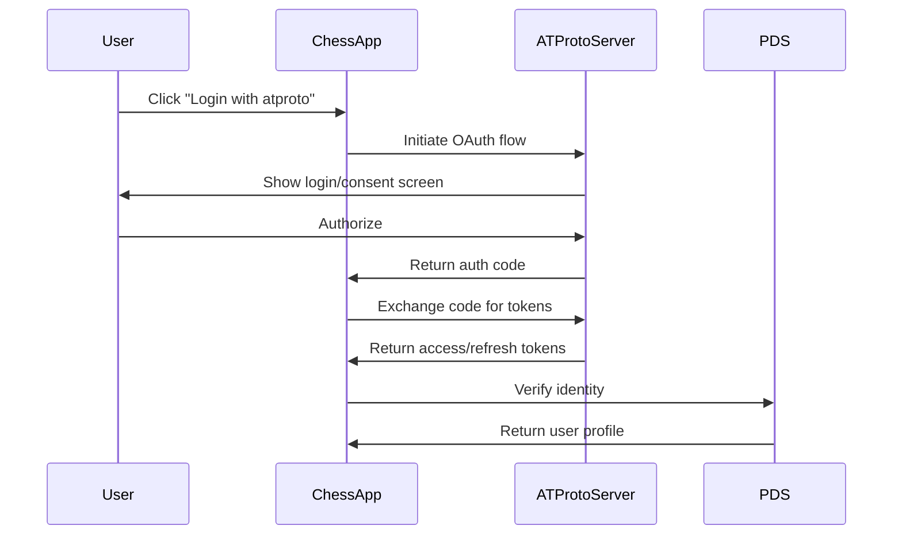

# AT Protocol Integration Specification

## Overview
This document outlines the integration of the chess application with AT Protocol (atproto) for decentralized identity, data storage, and social features.

## Architecture

### Authentication Flow


### Data Models

#### Lexicon Definitions

##### com.chess.game.record
```typescript
{
  lexicon: 1,
  id: "com.chess.game.record",
  defs: {
    main: {
      type: "record",
      key: "tid",
      record: {
        type: "object",
        required: ["white", "black", "pgn", "result", "createdAt"],
        properties: {
          white: { type: "string", format: "did" },
          black: { type: "string", format: "did" },
          pgn: { type: "string", maxLength: 10000 },
          result: { 
            type: "string", 
            enum: ["1-0", "0-1", "1/2-1/2", "*"] 
          },
          timeControl: { type: "string" },
          rated: { type: "boolean", default: true },
          opening: { type: "string" },
          eco: { type: "string", maxLength: 3 },
          createdAt: { type: "string", format: "datetime" },
          completedAt: { type: "string", format: "datetime" },
          moves: { type: "integer" },
          analysisUrl: { type: "string", format: "uri" }
        }
      }
    }
  }
}
```

##### com.chess.profile.record
```typescript
{
  lexicon: 1,
  id: "com.chess.profile.record",
  defs: {
    main: {
      type: "record",
      key: "self",
      record: {
        type: "object",
        required: ["elo", "games", "wins", "losses", "draws"],
        properties: {
          elo: { type: "integer", minimum: 0, maximum: 3000 },
          games: { type: "integer", minimum: 0 },
          wins: { type: "integer", minimum: 0 },
          losses: { type: "integer", minimum: 0 },
          draws: { type: "integer", minimum: 0 },
          peak: { type: "integer", minimum: 0, maximum: 3000 },
          title: { 
            type: "string", 
            enum: ["", "FM", "IM", "GM", "WFM", "WIM", "WGM"] 
          },
          country: { type: "string", maxLength: 2 },
          joined: { type: "string", format: "datetime" },
          lastActive: { type: "string", format: "datetime" },
          preferences: {
            type: "object",
            properties: {
              timeControl: { type: "string" },
              pieceSet: { type: "string" },
              board: { type: "string" },
              autoQueen: { type: "boolean" },
              confirmMove: { type: "boolean" },
              sound: { type: "boolean" }
            }
          }
        }
      }
    }
  }
}
```

##### com.chess.challenge.record
```typescript
{
  lexicon: 1,
  id: "com.chess.challenge.record",
  defs: {
    main: {
      type: "record",
      key: "tid",
      record: {
        type: "object",
        required: ["challenger", "challenged", "timeControl", "status"],
        properties: {
          challenger: { type: "string", format: "did" },
          challenged: { type: "string", format: "did" },
          timeControl: { type: "string" },
          rated: { type: "boolean", default: true },
          color: { 
            type: "string", 
            enum: ["white", "black", "random"] 
          },
          status: { 
            type: "string", 
            enum: ["pending", "accepted", "declined", "cancelled"] 
          },
          message: { type: "string", maxLength: 280 },
          createdAt: { type: "string", format: "datetime" },
          expiresAt: { type: "string", format: "datetime" }
        }
      }
    }
  }
}
```

##### com.chess.tournament.record
```typescript
{
  lexicon: 1,
  id: "com.chess.tournament.record",
  defs: {
    main: {
      type: "record",
      key: "tid",
      record: {
        type: "object",
        required: ["name", "format", "timeControl", "startTime"],
        properties: {
          name: { type: "string", maxLength: 100 },
          description: { type: "string", maxLength: 1000 },
          format: { 
            type: "string", 
            enum: ["swiss", "roundrobin", "knockout", "arena"] 
          },
          timeControl: { type: "string" },
          rounds: { type: "integer", minimum: 1 },
          maxPlayers: { type: "integer", minimum: 2 },
          minRating: { type: "integer", minimum: 0 },
          maxRating: { type: "integer", minimum: 0 },
          startTime: { type: "string", format: "datetime" },
          status: { 
            type: "string", 
            enum: ["upcoming", "ongoing", "completed", "cancelled"] 
          },
          participants: {
            type: "array",
            items: { type: "string", format: "did" }
          },
          standings: {
            type: "array",
            items: {
              type: "object",
              properties: {
                player: { type: "string", format: "did" },
                points: { type: "number" },
                tiebreak: { type: "number" }
              }
            }
          }
        }
      }
    }
  }
}
```

### Repository Structure
```
at://did:plc:user123/com.chess.profile/self
at://did:plc:user123/com.chess.game/tid123
at://did:plc:user123/com.chess.challenge/tid456
```

## Implementation

### AtprotoService Class
```javascript
import { BskyAgent } from '@atproto/api';

class AtprotoService {
  constructor() {
    this.agent = new BskyAgent({ service: 'https://bsky.social' });
    this.session = null;
  }

  async login(identifier, password) {
    try {
      const response = await this.agent.login({ identifier, password });
      this.session = response.data;
      this.saveSession();
      return { success: true, did: this.session.did };
    } catch (error) {
      return { success: false, error: error.message };
    }
  }

  async createSession(handle) {
    // OAuth flow implementation
    const authUrl = `https://bsky.social/oauth/authorize?` +
      `client_id=${CLIENT_ID}&` +
      `redirect_uri=${REDIRECT_URI}&` +
      `scope=read write&` +
      `state=${generateState()}`;
    
    window.location.href = authUrl;
  }

  async refreshSession() {
    if (!this.session?.refreshJwt) return false;
    
    try {
      const response = await this.agent.resumeSession(this.session);
      this.session = response.data;
      this.saveSession();
      return true;
    } catch {
      return false;
    }
  }

  async getProfile(did) {
    try {
      const response = await this.agent.api.app.bsky.actor.getProfile({ 
        actor: did 
      });
      
      // Also fetch chess profile
      const chessProfile = await this.getRecord(
        did, 
        'com.chess.profile', 
        'self'
      );
      
      return {
        ...response.data,
        chess: chessProfile
      };
    } catch (error) {
      console.error('Failed to fetch profile:', error);
      return null;
    }
  }

  async createGame(gameData) {
    const record = {
      $type: 'com.chess.game.record',
      white: gameData.white,
      black: gameData.black,
      pgn: gameData.pgn,
      result: gameData.result,
      timeControl: gameData.timeControl,
      rated: gameData.rated,
      opening: gameData.opening,
      eco: gameData.eco,
      createdAt: new Date().toISOString(),
      completedAt: gameData.completedAt,
      moves: gameData.moves
    };

    try {
      const response = await this.agent.api.com.atproto.repo.createRecord({
        repo: this.session.did,
        collection: 'com.chess.game',
        record
      });
      
      return response.data;
    } catch (error) {
      console.error('Failed to create game record:', error);
      throw error;
    }
  }

  async updateStats(stats) {
    const record = {
      $type: 'com.chess.profile.record',
      elo: stats.elo,
      games: stats.games,
      wins: stats.wins,
      losses: stats.losses,
      draws: stats.draws,
      peak: stats.peak,
      lastActive: new Date().toISOString(),
      preferences: stats.preferences || {}
    };

    try {
      // Check if profile exists
      const existing = await this.getRecord(
        this.session.did, 
        'com.chess.profile', 
        'self'
      );
      
      if (existing) {
        // Update existing record
        await this.agent.api.com.atproto.repo.putRecord({
          repo: this.session.did,
          collection: 'com.chess.profile',
          rkey: 'self',
          record
        });
      } else {
        // Create new record
        await this.agent.api.com.atproto.repo.createRecord({
          repo: this.session.did,
          collection: 'com.chess.profile',
          rkey: 'self',
          record
        });
      }
    } catch (error) {
      console.error('Failed to update stats:', error);
      throw error;
    }
  }

  async createChallenge(challengedDid, options) {
    const record = {
      $type: 'com.chess.challenge.record',
      challenger: this.session.did,
      challenged: challengedDid,
      timeControl: options.timeControl,
      rated: options.rated ?? true,
      color: options.color || 'random',
      status: 'pending',
      message: options.message,
      createdAt: new Date().toISOString(),
      expiresAt: new Date(Date.now() + 24 * 60 * 60 * 1000).toISOString()
    };

    try {
      const response = await this.agent.api.com.atproto.repo.createRecord({
        repo: this.session.did,
        collection: 'com.chess.challenge',
        record
      });
      
      // Send notification
      await this.notifyChallenge(challengedDid, response.data.uri);
      
      return response.data;
    } catch (error) {
      console.error('Failed to create challenge:', error);
      throw error;
    }
  }

  async getChallenges() {
    try {
      // Get sent challenges
      const sent = await this.agent.api.com.atproto.repo.listRecords({
        repo: this.session.did,
        collection: 'com.chess.challenge',
        limit: 50
      });
      
      // Get received challenges (requires indexing service)
      const received = await this.searchChallenges(this.session.did);
      
      return {
        sent: sent.data.records,
        received: received
      };
    } catch (error) {
      console.error('Failed to fetch challenges:', error);
      return { sent: [], received: [] };
    }
  }

  async subscribeToGames(callback) {
    // WebSocket subscription for real-time updates
    const ws = new WebSocket('wss://bsky.social/xrpc/com.atproto.sync.subscribeRepos');
    
    ws.onmessage = async (event) => {
      const data = JSON.parse(event.data);
      
      // Filter for chess game events
      if (data.commit?.collection === 'com.chess.game') {
        const game = await this.getRecord(
          data.did, 
          'com.chess.game', 
          data.commit.rkey
        );
        callback(game);
      }
    };
    
    return () => ws.close();
  }

  async shareGame(gameUri, message) {
    // Create a post about the game
    const post = {
      $type: 'app.bsky.feed.post',
      text: message || 'Check out this chess game!',
      embed: {
        $type: 'app.bsky.embed.external',
        external: {
          uri: `https://chess.app/game/${gameUri}`,
          title: 'Chess Game',
          description: 'View and analyze this chess game'
        }
      },
      createdAt: new Date().toISOString()
    };

    try {
      await this.agent.api.app.bsky.feed.post.create(
        { repo: this.session.did },
        post
      );
    } catch (error) {
      console.error('Failed to share game:', error);
    }
  }

  // Helper methods
  async getRecord(did, collection, rkey) {
    try {
      const response = await this.agent.api.com.atproto.repo.getRecord({
        repo: did,
        collection,
        rkey
      });
      return response.data.value;
    } catch {
      return null;
    }
  }

  saveSession() {
    if (this.session) {
      localStorage.setItem('atproto_session', JSON.stringify(this.session));
    }
  }

  loadSession() {
    const saved = localStorage.getItem('atproto_session');
    if (saved) {
      this.session = JSON.parse(saved);
      return true;
    }
    return false;
  }
}

export default AtprotoService;
```

## Features

### 1. Decentralized Identity
- Users log in with their AT Protocol handle
- Chess profile linked to DID
- Portable identity across clients

### 2. Game Storage
- All games stored in user's repository
- PGN format for portability
- Automatic backup and sync

### 3. Social Features
- Challenge other AT Protocol users
- Share games as posts
- Follow chess players
- Tournament announcements

### 4. Stats Tracking
- ELO stored in user's repo
- Game history queryable
- Cross-client compatibility

### 5. Real-time Updates
- WebSocket subscriptions for live games
- Challenge notifications
- Tournament updates

## Security Considerations

### 1. Authentication
- OAuth 2.0 flow for secure login
- Refresh tokens stored securely
- Session timeout handling

### 2. Data Validation
- Lexicon validation for all records
- Move validation before storage
- Rate limiting on API calls

### 3. Privacy
- Game visibility settings
- Optional anonymous play
- Private challenge system

## Deployment

### Environment Variables
```env
ATPROTO_SERVICE=https://bsky.social
ATPROTO_CLIENT_ID=com.chess.app
ATPROTO_REDIRECT_URI=https://chess.app/auth/callback
ATPROTO_HANDLE=chess.app
```

### CORS Configuration
```javascript
// Required headers for AT Protocol
app.use((req, res, next) => {
  res.header('Access-Control-Allow-Origin', 'https://bsky.social');
  res.header('Access-Control-Allow-Credentials', 'true');
  res.header('Access-Control-Allow-Headers', 'Authorization, Content-Type');
  next();
});
```

## Future Enhancements

### 1. Federation
- Multi-server game relay
- Distributed tournaments
- Cross-instance challenges

### 2. Advanced Features
- Game analysis sharing
- Coach/student relationships
- Team competitions
- Live commentary system

### 3. Integration Points
- Chess engine APIs
- Opening databases
- Endgame tablebases
- Analysis services